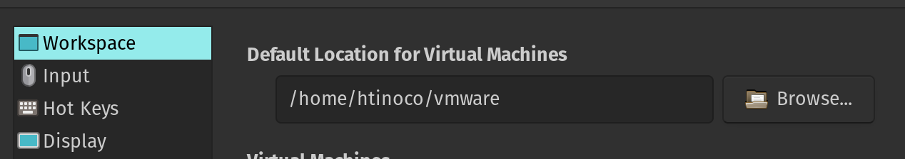

# VMWare Mgmt

VMWare Management with Ansible, Packer and Terraform

Personal project used to manage my local VMWare Workstation Pro & ESXI/vSphere instances. Majority of the documentation here is specific to my home network.

## Requirements

- Docker
- Docker-Compose

---
## General
The folder structure for the playbooks, reside under `playbooks` and follow the pattern based on env, either `workstation` or `vsphere`.

```bash
├── playbooks
│   ├── common
│   │   ├── pb.onboard.yml
│   │   ├── pb.rsync.yml
│   │   └── pb.snmp.yml
│   ├── network
│   │   ├── pb.deploy-vpn.yml
│   │   └── pb.edgeos-update.yml
│   ├── vsphere
│   │   ├── pb.configure-vsphere.yml
│   │   ├── pb.deploy-vm.yml
│   │   ├── pb.get-vcenter-info.yml
│   │   ├── pb.vsphere_to_nautobot.yml
│   │   └── tasks
│   │       └── deploy-vms.yml
│   └── workstation
│       ├── pb.clone-vm.yml
│       ├── pb.get-vms.yml
│       └── pb.start-vms.yml
```

This folder is a mounted volume on the docker container used to execute the variety of playbooks available. This simplifies the ability to write, test and customize playbooks with a built Docker image.

The project uses both community `vmware.vmware_rest` and `community.vmware.vmware_guest` collections for the ansible playbooks, as well as the VMWare Workstation Pro `qsypoq.vmware_desktop` collection.

## Network Playbooks

The `pb.edgeos-update.yml` playbook is essentially only to create a static DNS entry in the local router EdgeOS router of my network.
This PB connects to the edge-router and loops through a specified group and sets the `inventory_hostname` + `ansible_host` magic variable as a static entry.

## vSphere Playbooks
The local env has an ESXI Server with vSphere provisioned. The Ansible Collections are more mature and robust and provide an incredible amount of flexibility and customization. This is the preferred method when deploying new VM's in my env.

### Deploying a new template

Our SoT is our inventory file at the moment. Create a new entry under the `servers_esxi` group. It must include a hostname and `ansible_host` ip address. These values are required in the playbook.

Example:
```
docker-compose run cli playbooks/vsphere/pb.deploy-vm.yml -e cloned_vm_name="cloned_vm_name"
```

Variables that must be defined and can be overridden with `extra_vars`
- cloned_vm_name: "VM Name"
- datacenter: "CrunchyDatacenter"
- folder: "Nautobot Plugins"
- template: "Ubuntu-Template"

After the playbook has been deployed, run the `common` playbook, `pb.onboard.yml` to update all the necessary items.

## Packer Build

Export the password for vSphere

```bash
export VMWARE_PASSWORD=....
```

Call the MAKE target to execute the packer build

```bash
make ubuntu_base
```

## Terraform

First, you must create the workspace in Terraform Cloud and set to `Local` execution. Without this, you will receive errors as the execution will happen in terraform cloud.

Run the `terraform_plan` make target

 If everything looks good, and you want to deploy, execute `terraform_deploy`

## vMware Workstation Pro Playbooks
Ensure that the VMWARE API is running.

Initial run will require -C flag to configure user/password.

```bash
vmrest -c workstationapi-cert.pem -k workstationapi-key.pem
```

### Structure

The current home setup involves a VMWare Workstation Pro running on the main workstation machine. There is a Ubuntu 21.01 Server Guest VM that's used as a template. (This is an env variable for machine id) and it's used to quickly build new Guest VM's with all the necessary tools to have an isolated environment ready for development. A mounted, shared folder that stores all the GIT repos is included in 'mnt/hgfz/Pyprogz'. The onboarding playing, `pb.onboard.yml` ensures it's mounted correctly. Also, all the networking is statically assigned after coming up via DHCP, using `netplan`.

This has become very helpful for development of Django that take up multiple ports tied to any given machine and allows me to quickly change from one env to the other without having to shutdown and rebuild to free up ports and IP's when loading Django apps, as well as having a simple DNS entry to quickly access the projects.

Included in template:
    - Docker
    - Docker Compose
    - Python3
    - Pip
    

### Examples

The goal of this project was to have a quick way to create a simple VM from a local template. The local template is referenced by the ID of the Virtual Machine. This is specified via env variable, `VM_ID`.

The name of the new VM to create can also be overridden by extra-vars while invoking the playbook.
To run the playbook within a docker container:

```bash
docker-compose build && docker-compose run cli pb.clone-vm.yml -e cloned_vm_name="name of new cloned vm"
```

## Example Env Variables
There is an example file inside the docs folder of the repository at `docs/example-env.txt`.

```bash
export WORKSTATION_URL=... [API URL]
export WORKSTRATION_USERNAME=...
export WORKSTRATION_PASSWORD=...
export WORKSTRATION_PORT=...
export WORKSTATION_VALIDATE_CERTS=...
export CLONED_VM_NAME=... [NAME OF THE NEW VM]
export VM_ID=... [VM ID BEING USED AS TEMPLATE TO CLONE FROM]
export WORKSTATION_PROJECT_DIR=... [PATH TO WHERE VM SHOULD BE STORED]
export ansible_password=... [STANDARD ANSIBLE]
export ansible_user=...[STANDARD ANSIBLE]
```

`WORKSTATION_PROJECT_DIR` must match the default location for Virtual Machines in Workstation Env.

